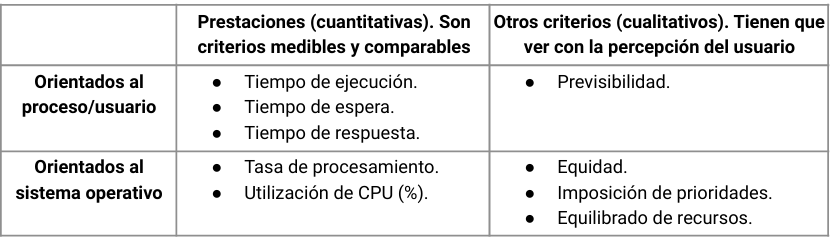
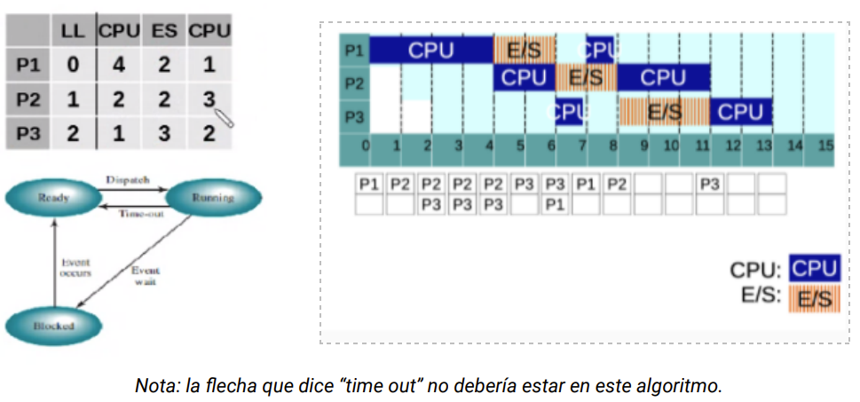
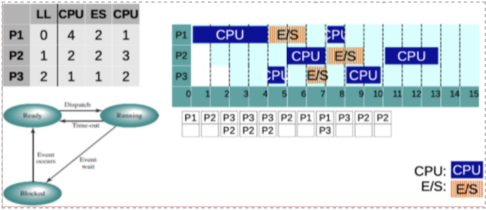
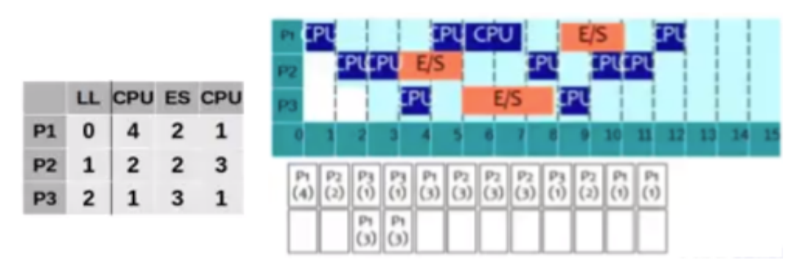
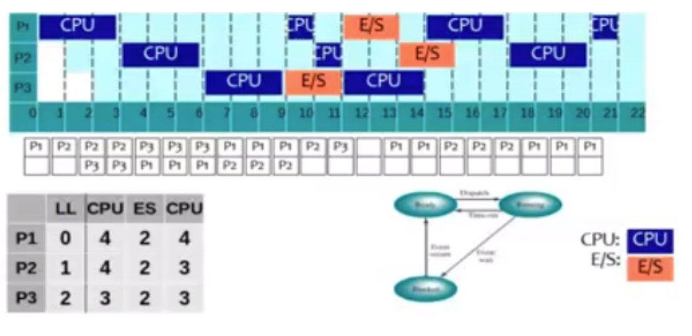
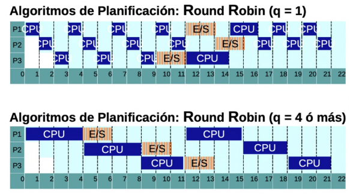
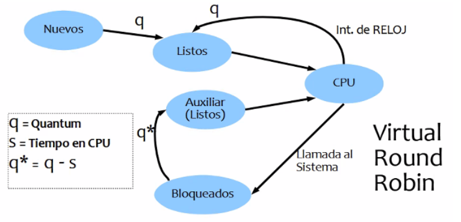
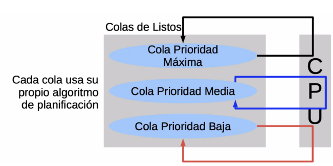
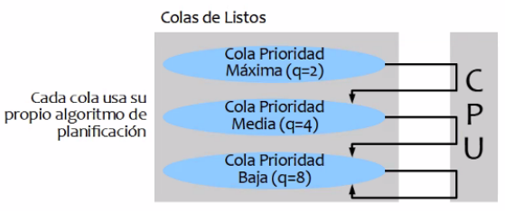

<h1>Planificación</h1>

**Problemas de la multiprogramación**: cuando hay muchos procesos queriendo ejecutar al mismo tiempo, se puede car en alguno de los siguientes casos:

- Disparidad de tiempo en el uso de la CPU
- Procesos que no llegan a ejecutarse nunca
- Degradación del tiempo de respuesta del sistema.
- Memoria RAM llena y CPU sin utilizarse.

La clave para no caer en estos escenarios es la coordinación (planificación/scheduling).

**Nivel de multiprogramación:** cantidad de procesos activos en memoria principal. Toma en cuenta los proceso en estado Ready, Running y Blocked.

**Tipos de procesos**:

- Limitados por CPU (CPU bound): aquellos procesos que requieren más tiempo de CPU que de uso de los dispositivos de E/S
- Limitados por E/S (IO bound): realizan cálculos muy básicos pero hacen uso de los dispositivos de E/s constantemente.

<h2>¿Que es la planificación?</h2>

**Objetivos**:

- Asignar procesos al procesador.
- Rendimiento/productividad
- Optimizar algún aspecto del comportamiento del sistema.

**Tipos de planificación**: los nombres (largo, mediano y corto plazo) hacen referencia a la "frecuencia" con la cual intervienen estos planificadores.

- *Largo plazo:* Su objetivo es determinar qué procesos pueden o no ser admitidos en el sistema (controla quiénes pueden pasar a la cola de Ready y cuando). Esto determina el grado de multiprogramación del sistema. Se incluye el estado Exit porque si está muy saturado puede mandar algún proceso a Exit.
  - Admitir un proceso (pasarlo a Ready) aumenta el grado de multiprogramación.
  - Finalizar un proceso (Exit) disminuye el grado de multiprogramación
- *Mediano plazo:* También controla el grado de multiprogramación manejando los estados Ready/Suspended y Blocked/Suspended, que envían a un proceso de memoria principal al disco, Es decir, este planificador realiza operaciones de swapping. 
  - Swap in: cargar nuevamente en RAM a un proceso suspendido. Aumenta el grado de multiprogramación
  - Swap out: pasar un proceso de RAM a disco. Baja el grado de multiprogramación
- *Corto plazo:* decide cual es el próximo proceso que se debe ejecutar. Ejecuta constantemente (cada vez que ocurre un evento que libera la CPU o que da la oportunidad de elegir un proceso con mayor prioridad). Debe minimizar el overhead. Su trabajo se centra en las arista de dispatch y timeout, pasando por el bloqueo de procesos cuando solicitan algún servicio. Para manejar los servicios bloqueados el SO maneja listas/colas de bloqueados:

Estos algoritmos se clasifican en dos:

- Con desalojo: considerar todos los eventos en los que un proceso llega a Ready.
- Sin desalojo: sólo considera eventos que liberan CPU. Pueden monopolizar la CPU

*Funciones*:

- Controla el tráfico de procesos.
- Dispatcher: encargado de darle a la CPU el proceso elegido.
- Context switch: se encarga de la permutación de procesos.

<h2>Criterios de planificación</h2>

Para realizar la planificación necesitamos basarnos en ciertas métricas que nos permiten medir lo datos acerca del funcionamiento del sistema.

**Cuantitativos**:

- *Tiempo de ejecución:* mide el tiempo desde que se solicita la creación de un proceso hasta que finaliza.
- *Tiempo de espera:* suma todos los intervalos de tiempo que el proceso estuvo esperando en Ready. Los planificadores tienen este indicador en cuenta la momento de asignar prioridades.

$TiempoDeEspera = TiempoFinal - TiempoLlegada - TiempoDeCPU$

- *Tiempo de respuesta:* tiempo que transcurre desde que el proceso es iniciado hasta que da la primera respuesta

$TiempoDeRespuesta = TiempoFinal - TiempoDeLlegada$

- *Tasa de procesamiento: mide la cantidad de procesos que finalizan en un intervalo de tiempo determinado.*
- *Utilización de la CPU:* mide el porcentaje de tiempo en el cual la CPU estuvo ocupada en un intervalo de tiempo. Mientras más alto el número mejor, siempre se intenta de que la CPU esté ocupada.

**Cuantitativos**:

- *Previsibilidad*: orientado al usuario. Hace referencia a qué comportamiento espera el usuario del sistema.
- *Equidad/Imposición de prioridades/Equilibrado de recursos*: trata de asignar prioridades de manera pareja para que todos los procesos se puedan ejecutar y se asignen los recursos de forma equitativa.

<h2>Algoritmos de planificación</h2>

**Definición**:

- A cada proceso se le asigna una prioridad (se guarda el PCB y va cambiando).
- La prioridad de un proceso puede variar en cada decisión
- El planificador selecciona el proceso de prioridad más alta.

**FIFO (First in First Out)**:

*Explicación del gráfico*: Arranca el proceso 1 ejecutando sus 4 unidades de CPU. Los cuadrados debajo del Gantt muestran los procesos que están ready.
En el momento 4, el proceso 1 realiza una syscall. En este momento, la syscall bloquea al proceso y la CPU queda libre. ¿A quién le toca seguir ejecutando? Se fija en a lista ready y como ejecuta el primero que llega, ejecuta el proceso 2. En el instante 6 se bloquea y el proceso 1 se desbloquea. El proceso 1 que se desbloqueó, se posiciona al final de ready. Por lo tanto, al que le toca ejecutar en el instante 6 es al proceso 3. Este proceso se bloquea, el proceso 2 también está bloqueado y el único que puede ejecutar es el proceso 1. Entonces ejecuta ese.

**SJF (Shortest Job First) - sin desalojo**: Ejecuta el que tenga la ráfaga de CPU más corta.

*Explicación del gráfico*: arranca el proceso 1 con sus 4 instancias de tiempo. En ese instante ya están el proceso 2 y 3 en ready, pero como se ordenan según el que tenga el menor tiempo de ejecución de CPU, primero se ordena el proceso 3 y luego el 2 en la cola de prioridades. Por lo que en el instante 4, el proceso 3 ejecuta

Si hay dos procesos que quieren ejecutar y tienen la misma ráfaga, entonces seleccionamos por FIFO.

- **1° Problema (Starvation / Inanición)**: ocurre cuando a un proceso se le niega la posibilidad de utilizar un recurso (en este caso la CPU) por la constante aparición de otros procesos con mayor prioridad.
- **2° Problema**: en realidad es imposible saber cuánto tiempo va a usar la CPU un proceso, por lo que el algoritmo no se puede implementarse en la realidad. Las ráfagas deben estimarse.

**SJF con estimación de ráfaga**: para la estimación de las ráfagas futuras usaremos la siguiente fórmula:

$EST_{n+1} = \alpha * TE_n + (1 - \alpha)* EST_n$

$TE_n$ = Tiempo de ejecución de la ráfaga actual
$EST_n$ = Tiempo estimado para la ráfaga actual
$EST_{n+1}$ = Tiempo estimado para la próxima ráfaga
$\alpha$ = Constante entre 0 y 1

**SJF con desalojo / SRT (Shortest remaining time)**: implica que el proceso que está siendo ejecutado puede ser expulsado de la CPU. Cada vez que un nuevo proceso llega a la cola Ready se pregunta si tiene mayor prioridad que el que está ejecutando. 

**RR (Round Robin)**: la cola de Ready se manea con FIFO pero el SO define un quantum (que dispara una interrupcion de clock) para desalojar un proceso cuando acaba su quantum

*Quantum muy chico vs quantum mucho más grande*: si bien parece que usando quantums distintos todos los procesos terminan de ejecutar en el mismo instante, el de quantum más chico tiene mucho más overhead, por lo que hay un montón de intervalos de tiempo en los que ejecuta el SO para administrar el cambio de proceso que no estamos graficando pero existen y hacen que termine siendo ineficiente.
En el quantum más grande, es tan grande el quantum que no llega a cortar nunca al proceso, por lo que termina siendo un FIFO

**VRR (Virtual Round Robin)**: dado que el RR favorece a los procesos CPU Bound, el VRR surge para favorecer a los procesos IO Bound. Para esto, ahora hay dos colas, una con mayor prioridad que la otra. La idea es que, la cola de mayor prioridad, vayan los procesos que terminen de hacer una E/S (que están en Blocked y, normalmente, tendrían que ir a la cola de Ready) para que no tengan que competir con los procesos CPU Bound.

El quantum se acumula en este algoritmo.

- Cola AUX ready (+):
  - Vienen los procesos después de hacer IO.
  - Su quantum ahora es $qDefinido - tiempoQueYaUsoCPU$
  - Cola de mayor prioridad
- Cola Ready (-)
  - Vienen los procesos cuando se acabó su q. Salen con un q completo.
  - Obviamente esta cola no va a ejecutar hasta que la otra cola esté vacía 

**HRRN (Highest Response Ratio Next)**: Contempla Aging, por lo que resuelve el problema de inanición del SJF. En este algoritmo va a ejecutar el que tenga mayor tasa de respuesta (R), que se calcula
$R = \frac{w+s}{s}$
$w$: es el tiempo esperando en ready
$S$: lo que va a usar de CPU (se llama "tiempo de cpu esperado").

Tener en cuenta que S, si bien lo sacamos de la tabla fijándonos cuánto dura la próxima rafaga de CPU, en realidad se estima con estimadores porque no se conoce.

**Algoritmos de colas multinivel**: se define una prioridad para cada proceso y cada prioridad tiene su propia cola. Puede haber muchas colas pero nosotros vamos a trabajar con 3: alta, media y baja. A su vez, cada cola puede usar su propio algoritmo

**Algoritmo por prioridades**: Se define una única cola de Ready. A cada proceso se le define una prioridad y se ordenan todos los procesos en esta lista. Puede ser con desalojo o sin desalojo.

**Multinivel retroalimentado**: es parecido a las colas multinivel porque hay varias colas de Listos y cada cola puede tener su propio algoritmo. Cada cola tienen un quantum y, a su vez que el proceso acaba el quantum va bajando de prioridad. Los procesos comienzan siempre en la cola de máxima prioridad. La prioridad es dinámica.
Puede usar mecanismos de aging (aumentarle la prioridad a un proceso que cayó en inanición) para evitar inanición.

