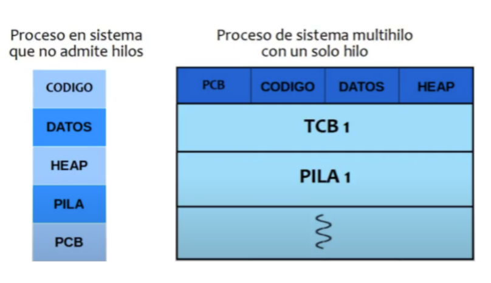
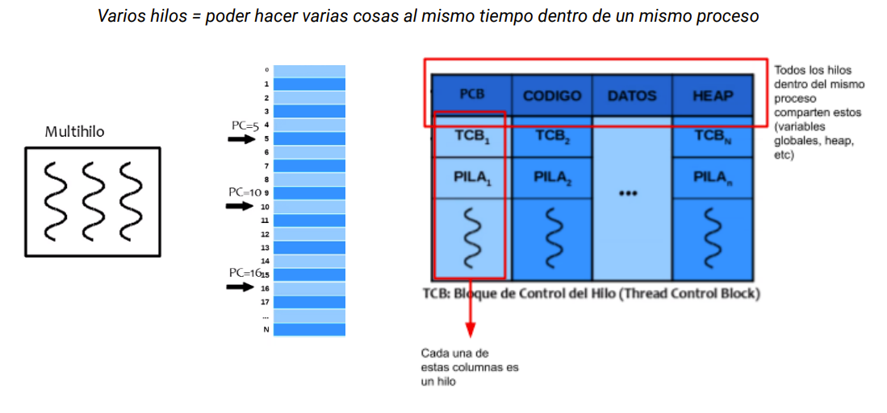
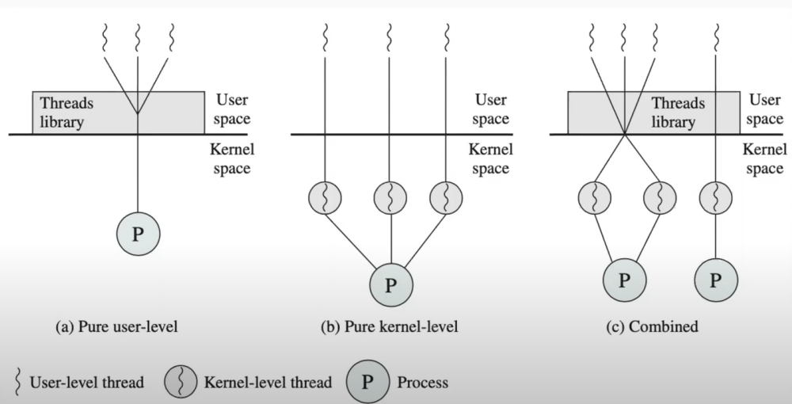

# Hilos

---

**Imagen de un proceso**: El código es una porción de sólo lectura, los datos contienen a las variables globales y el heap es la memoria dinámica. El stack y el PCB tienen algo en común y es que se modifican constantemente y están muy relacionados con la ejecución del proceso (esto es importante remarcarlo porque en los procesos multihilos cada hilo tendrá su propia pila y su propio TCB). Hasta ahora sólo conocíamos procesos con un único camino de ejecución (en forma secuencial), que podía ser un sistema que no admitía hilos o un proceso multihilo con un sólo hilo.

**Hilo:** es una línea de ejecución de un procesos. Los hilos son la unidad de trabajo del SO, dado que el SO se encarga de planificar a los hilos (de los procesos) para que todos puedan ejecutar (antes decíamos que el SO planificaban "procesos", ahora decimos que planifica "hilos"). El SO no es él único que puede planificar a los hilos, sino que existen bibliotecas que los procesos pueden implementar que se encargan de la planificación interna.
Un hilo comparte el código, datos y recursos con otros hilos de su mismo proceso, pero cada hilo tiene su propio stack y su propio TCB donde guarda su contexto de ejecución: su propio PC, su estado de ejecución, su contexto de ejecución,etc.

## Multihilos

Un programa multihilo contiene dos o más partes que se pueden ejecutar de manera concurrente. Es decir agrega más trazas de ejecución

**Estructuras involucradas**:

- *PCB*: se sigue manteniendo como la estructura necesaria para administrar la ejecución de todo el proceso, pero ahora con una diferencia. Como ahora tenemos varios caminos de ejecución, es necesario que cada hilo posea su propio stack. ¿Por que? Porque si yo quisiera tener tres caminos concurrentes de ejecución, tal vez el camino 1 esté llamado a la función A y el camino 2 llamando a la función B. Entonces, el mimo stack no me sirve para ir encadenando lo que hace cada hilo.
- *TCB (Thread Control Block)*: se contará un TCB por cada hilo, el cual guardará cierto tipo de información administrativa propia de cada hilo de ejecución.
  - Prioridad
  - ID de hilo (TID)
  - Estado
  - Contexto de ejecución del hilo
    - PC
    - Flags

*Nota respecto al cambio de hilo*: dado que cada TCB tiene su propio contexto de ejecución, cuando hay un cambio de hilo hay un cambio de contexto.

*Nota con respecto a la memoria*: las variables locales de los hilos no son compartidas (porque están en el stack), las únicas que se comparten son las globales.

**Ventajas de los hilos**:

- Capacidad de respuesta (cada hilo sigue su propia taza de ejecución y no debe esperar a que finalicen los otros).
- Menos overhead para el SO (es preferible tener muchos hilos en un sólo proceso que tener muchos procesos separados ya que el thread switch es más rápido porque los hilos comparten memoria y al cambiar de hilo no es necesario realizar un cambio de modo).
- Comparten recursos entre hilos
- Comunicación eficiente. Si un hilo deja algo en la memoria compartida, los demás hilos lo pueden leer fácilmente.
- Permite multiprocesamiento (en el caso de los KKLTs): puede ejecutarse cada hilo en un procesador distinto.
- Procesamiento asincrónico: no sigue un orden secuencial

**Desventajas de los hilos**: dependen del contexto en que se los use o las funcionalidades del proceso. Por ejemplo, al compartir recursos, a veces no es deseable que un hilo pueda consultar la memoria de otro hilo, sobre todo cuando se tratan de datos sensibles.

## Hilos de Kernel (Kernel level threads)

La administración del hilo está hecha por una biblioteca que provee el SO. Entonces, el SO conoce a los hilos, los crea, los destruye y los administra.

Los hilos van a estar sujetos a la misma planificación que tiene el SO. El planificador de corto plazo del SO deja de planificar los procesos como entidades absolutas y empieza a planificar los KLT de cada proceso. Es decir, ahora, en vez de elegir que proceso ejecuta, el planificador elige por hilo.

**Ventajas**:

- Las syscalls bloqueantes sólo bloquean al hilo en cuestión.
- Multiprocesamiento de hilos del mismo proceso: los KLT pueden ejecutar cada uno en un procesador distinto.
- Menor overhead que si se usaran distintos procesos.

**Desventajas**:

- Mayor overhead que en los ULT(cualquier tarea de administración implica un mode switch, la creación de un hilo implica una syscall,etc).
- Son menos estables y seguros que los procesos. Dado que los KLTs de un miso proceso comparten heap, si un hilo fura a generar memory leaks esta memoria alocada no se liberaría hasta la finalización del proceso en su totalidad.

## Hilos de usuario (User Level Threads)

La administración del hilo está hecha por una biblioteca de usuario que el proceso incorpora y ejecuta. Es decir, esta biblioteca se encarga de crear a los hilos y de administrarlos sin recurrir a la ayuda del SO. Esto genera que la administración esté hecha dentro del espacio de usuario y que no haya involucración alguna del SO.

Se puede decir que hay una doble planificación porque el SO planifica al proceso completo y la biblioteca planifica a los hilos.

**Ventajas**:

- Bajo overhead: no se necesita la intervención del SO. No hay syscalls ni cambios de modo.
- Planificación personalizada: internamente puede tener un planificador (que no tiene por que ser el mismo que el SO) para planificar la ejecución de los hilos
- Portabilidad: como la planificación es a través de una biblioteca, puedo utilizar una biblioteca basada en funciones que pertenezcan a bibliotecas estándares, lo que hará que el programa sea portable
- Su creación es más liviana y los cambios de hilo también.

**Desventaja**:

- No permite a los hilos ejecutar en procesadores distintos: dado que es el SO quien asigna el procesador y dado que los hilos no son conocidos por el SO, no hay manera que el SO pueda mandar a los hilos a diferentes procesadores
- Si ocurriera una syscalll bloqueante, todo el proceso se bloquearía, bloqueando todos los hilos. Esta problemática puede resolverse con una técnica llamada *jacketing*

**E/S bloqueante y ULT**:La problemática es que las llamadas al sistema son bloqueantes. Supongamos que mientras estaba ejecutando un ULT llama a `fwrite`, que es un wrapper de `WRITE`. Esto sería una syscall bloqueante. Se bloquea todo el proceso, no sólo el ULT, lo que impide que los otros ULT sigan ejecutando. Para resolver este problema y que no se bloqueen todos los ULT, sino solamente el ULT que realizó la syscall, vamos a usar una técnica llamada *jacketing*.
Pero acá tenemos otro problema a resolver: cada proceso tiene su PCB. Cuando un proceso se bloquea, en el PCB se guarda el contexto de ejecución y registros del procesador. Entre esos registro también está el PC. Este apunta a la siguiente instrucción a ejecutar. Cuando el proceso deje de estar bloqueado y pase a listo, se ejecutará el mismo hilo que venía ejecutando porque ahí quedó el PC cuando se produjo la interrupción. Entonces se pierde un poco esa planificación interna de los hilos (porque no da lugar a que se realice, es decir, comienza a ejecutar el hilo directamente).

Para solucionar este problema la solución es ejecutar el `Wrapper` de una biblioteca (`fwrite_ULT` podria ser), que antes de bloquearme me permite cambiar de hilo, es decir, si mi PC apuntaba a una instrucción de un hilo, antes de llamar a fwrite hace que PC apunte a otro lado (la planificación dirá de donde a donde). O sea, la interrupción y bloqueo se siguen produciendo pero me permite mantener mi planificación interna de hilos. Entonces, cuando el enunciado diga que se maneja una biblioteca de hilos de usuario con una planificación determinada, significa que se respeta esa planificación, porque la biblioteca usa sus propios wrappers.

**Jacketing / Revestimiento**: ocurre cuando en lugar de hacer la syscall bloqueante, se efectúa en modo no bloqueante. Hay que tener en cuenta que la mayoría de las operaciones bloqueantes tienen su contraparte no bloqueante. Cuando el programa le pide realizar una IO bloqueante, la biblioteca se la pide al SO como no bloqueante, y la biblioteca "bloquea internamente" (o sea, no le da turno de ejecución) al hilo que pidió hacer la IO. Y, cada tanto, le va a preguntar al SO si la operación terminó o no. Si terminó, lo "desbloquea". 
Además podemos seguir con nuestra planificación interna. En los ejercicios asumimos que no hay jacketing a menos que diga lo contrario.

## Combinación de hilos

**¿Se pueden combinar KLTs y ULTs en un mismo proceso?**: Si. El propósito de hacer algo así es intentar obtener los beneficios de ambas estrategias.

