# Concurrencia y sincronización

---

**Distintas formas de concurrencia**:

- *Multiprogramación*: implica múltiples procesos activos en memoria en un momento dado. Los procesos se van turnando en el uso de los recursos. Si bien hay varios procesos en memoria, solo uno puede ser ejecutado a la vez en una CPU
- *Multiprocesamiento*: manejo de múltiples procesos en un sistema multiprocesador, Muchos procesos ejecutando al mismo tiempo.
- *Procesamiento distribuido*: manejo de múltiples procesos en múltiples computadores distribuidas para ejecutar.
- *Compartición de recursos y competición por los recursos*:

**¿Por qué se usa la concurrencia?**

- Mejora la performance. Debido a la multiprogramación, si un proceso se encuentra bloqueado, para no dejar a la CPU ociosa, necesito ejecutar otro proceso en ese instante.
- Aplicaciones estructuradas: por cuestiones de diseño, un programa puede ser definido como un conjunto de procesos/hilos concurrentes.

## Condición de carrera

Situación donde varios actores (hilos o procesos) modifican datos compartidos y se obtienen diferentes resultados finales dependiendo del orden en el que se ejecuten los procesos o hilos (se dice que depende de la "velocidad" de ejecución de ellos, de ahí el nombre).
Para garantizar la coherencia debemos asegurar que solo uno de los procesos pueda acceder a manipulación de datos a la vez.Para esto hay que sincronizarlos. Solamente vamos a sincronizar dos procesos cuando acceden a los mismo datos (ya sea que los dos quieran escribir o uno de ellos quiere escribir y el otro leer). Pero, si los dos acceden en modo lectura, no hace falta sincronizarlos.
La sección donde puede ocurrir la condición de carrera se conoce como *sección crítica*

## Formas de interacción entre procesos

- Comunicación entre procesos
- Competencia de los procesos por los recursos.
- Cooperación de los procesos vía compartición
- Cooperación de los procesos vía comunicación

Si hay varios procesos, los mismo van a competir por el uso de memoria y demás recursos. En la competencia, el SO se va a encargar de decidir qué proceso recibe qué recursos y por cuánto tiempo.

### Requisitos que deben cumplirse dentro de la sección crítica

**Mutua exclusión**: sólo un proceso puede estar en la sección crítica usando un recurso. No puede haber ningún otro proceso o hilo en la misma sección para usar ese mismo recurso.

**Progreso**: cuando un proceso termina de usar el recurso de la sección crítica debe dar a aviso así los demás hilos o procesos pueden acceder a él

**Espera limitada**: la espera para entrar a la región crítica debe ser limitada. Se relaciona con el progreso. El proceso que está ejecutando en la región crítica debe avisar cuando termine de usarla porque sino los demás procesos que están esperando nunca se enterarían que está libre.

**Velocidad relativa**: qué tan rápido va a ejecutar un proceso sus instrucciones. Nunca puede ser predicho porque puede ocurrir interrupciones en el medio. Por más mínima que sea la operación no podemos decir con certeza cuánto va a durar.

*Consideraciones*:

- La sección critica debe ser lo más pequeña posible. Si la sección critica fuera muy grande (al punto en que un proceso debería esperar a que finalice otro para poder ejecutar) entonces no se podría tener procesos concurrentes porque la sección permanecería bloqueada.
- Un proceso que no está en una sección critica no interfiere de ninguna manera con otros procesos, entonces puede ejecutar lo que quiera.
- La permanencia en la sección critica debe ser por un tiempo finito y reducido
- Un proceso puede tener muchas secciones críticas.

**Condiciones de Bernstein**: Si se cumplen las siguiente condiciones entonces no existe la posibilidad de condición de carrera y no estamos en presencia de una sección critica.

- $R(A) \cap W(B) = {\empty}$ : Las variables que va a leer el proceso A no deben ser las que va a escribir el proceso B
- $R(B) \cap W(A) = {\empty}$ : igual a lo anterior
- $W(A) \cap W(B) = {\empty}$ : El conjunto de escritura de A debe ser distinto al conjunto de escritura de B. No deben escribir sobre las mismas variables.

### Posibles soluciones para la condición de carrera/Sección critica

Existen 4 tipos de soluciones:

- *De software*: implican que el programador modifique su código (ya sea usando flags, estructuras de condiciones, etc.)
- *De hardware*: Hace uso de instrucciones provistas por el HW para resolver la condición de carrera.
- *Provistas por el SO*: semáforos
- *Provistas por los lenguajes de programación*: se llaman "monitores". En general están provistas por los lenguajes orientados a objetos y están relacionadas con el concepto de encapsulamiento.

#### Soluciones de software

Todos las soluciones de software tienen el problema de espera activa, lo que produce un alto grado de overhead

##### Solución 1:

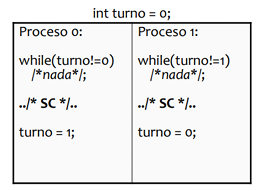

Se utiliza una sentencia `while` que realiza una especie de bloqueo hasta que cada proceso pueda ejecutar su sección. El proceso 0 va a ejecutar sus sentencias y cuando termine va a avisar que finalizó cambiando la variable `turno` a 1

*Ventajas*:

- Cumple con la mutua exclusión porque me aseguro que en la sección crítica haya únicamente un proceso ejecutando a la vez.

*Problemas*:

- Esta solución contempla únicamente dos procesos. De tener más, debería modifica el código.
- Tiene *espera activa* que es cuando un proceso/hilo evalúa repetidamente si una condición es cumplida o no (en este caso el `while`). Es mala práctica dado que el proceso ocupa la CPU para realizar un procesamiento no útil.
- No hay progreso. En este caso no se nota tanto pero si tuviéramos otro proceso *P2*, cuando termine de ejecutar podría poner `turno = 0`, por lo que no dejaría usar la sección al P1 por más que este pueda hacerlo.
- Alternancia: los procesos tienen un orden para acceder a la sección crítica

##### Solución 2:

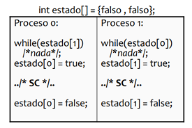

Se tiene un array con el estado de todos los procesos. Cuando un proceso empieza a ejecutar debe poner su estado en true. Cuando termina lo pone en false. En el `while` cada proceso evalúa si el estado de los otros procesos es false (lo que indicaría que no están usando la sección crítica).

**Ventajas**:

- En parte se soluciona el problema de la alternancia de la solución anterior porque ya no hay un orden para ejecutar. El proceso se fija si la sección critica está vacía y si lo está la usa.
- Cumple con progreso.

**Problemas**:

- Hay espera activa
- No cumple con la mutua exclusión. Por ejemplo, supongamos que se produce una interrupción por quantum en este instante:
  
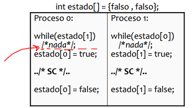

Cuando el otro proceso, el P1, comience a ejecutar y entre en el `while`, va a preguntar ¿Alguien está usando la sección critica? La respuesta es no (porque el P0 se interrumpió justo antes de avisar que iba a usar la sección critica). Entonces comenzará a ejecutar la sección critica el P1 y pondrá su estado en true. Cuando vuelva a ejecutar el P0, podrá acceder a la sección critica (dado que ya pasó el `while`), habiendo dos procesos ejecutando en la sección critica.

##### Solución 3

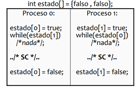

Esta solución surge a partir de la anterior. Si el problema de la anterior está cuando pregunto si puedo entrar y luego me declaro como que estoy usando la sección critica, ¿Por qué no lo hacemos al revés? Primero me declaro en true y luego entro a la sección.

**Ventajas**:

- Está resuelve la mutua exclusión

**Problemas**:

- No resuelve el progreso
- Los procesos pueden entrar en deadlcok. Esto quiere decir que se quedan los procesos bloqueados. Supongamos que se produce una interrupción en este instante:

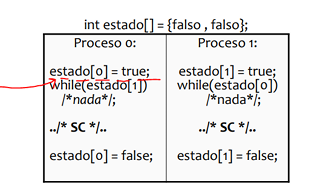

Entonces, el P0 se declara como interesado y justo ahí ocurre una interrupción. Cuando empiece a ejecutar el P1, tambien se va a declarar como interesado, pero cuando entre al `while` le va a decir que el P0 está usando la sección critica. Luego, cuando el P0 vuelva a ejecutar, le va a tocar entrar al `while`, donde le va a decir que el P1 está usando la sección critica. Así ambos procesos entrar en deadlock y ninguno podrá acceder al recurso.

##### Solución 4

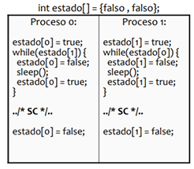

De nuevo, esta solución nace para intentar solucionar el problema de la solución anterior. Acá lo que ocurre es que ambos procesos ceden constantemente el paso a los otros procesos. Comienza cuando el proceso se declara como interesado. Entra al `while` y pregunta si la sección está ocupada. Si no lo está, entra y se vuelve a declarar como desinteresada y hace un sleep (para ceder el paso a algún otro proceso). Si ningún proceso la toma entonces se vuelve a declarar como interesada y sale del `while` para acceder a la sección

**Ventajas**:

- Respeta la mutua exclusión
- No tiene deadlock

**Problemas**:

- *Livelock*: un livelock es similar a un deadlock, excepto que el estado de los dos procesos involucrados cambia constantemente con respecto al otro mientras ningún proceso realiza un procesamiento útil. Livelock es una forma de inanición y la definición general sólo dice que un proceso específico no está procesando.
- Hay espera activa

##### Soluciones de software que sí funcionan (pero tienen espera activa)

- Algoritmo de Dekker
- Algoritmo de Peterson.
  - Soluciona el problema de la condición de carrera
  - Tiene espera activa
  - Considera una "sección de entrada" y una "sección de salida" para la mutua exclusión
  - Cumple con progreso

#### Soluciones de hardware

Se llaman de esta manera porque utilizan las instrucciones que provee el procesador (set de instrucciones).

##### Solución 1

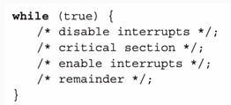

Algunas de las instrucciones que posee el procesador sirven para deshabilitar o habilitar interrupciones. Entonces, deshabilitando las interrupciones nos aseguramos que un programa ejecute en la sección critica por completo y, cuando sale de la sección critica, volvemos a habilitar las interrupciones.
Lo que hacemos es deshabilitar las interrupciones (sólo se pueden deshabilitar las enmascarables), luego ejecutamos la sección critica y finalmente volvemos a habilitarlas.

**Ventajas**:

- Cumplen con el objetivo

**Problemas**:

- Puede ocurrir que el proceso muera antes de poder volver a habilitar las interrupciones.
- Las interrupciones son importantes como para deshabilitarlas. No es bueno para la seguridad. Deshabilitarlas sería darle mucho poder a un proceso.
- El hecho de deshabilitar y habilitar las interrupciones para acceder a la sección critica vuelve al acceso más lento.

##### Solución 2

Consiste en utilizar instrucciones especiales del procesador.

*Test and Set (no ejecuta en modo kernel)*: lo que hace es preguntar y, de acuerdo a la pregunta que se hace (que es en realidad una condición) se defina un valor o no. Entonces, sigue la misma lógica que las soluciones de software dado que realiza una pregunta para poder acceder a la sección critica. Pero, tiene una ventaja y es que las instrucciones no se pueden interrumpir. Las instrucciones se ejecutan por completo y después se pregunta si hubo interrupciones.

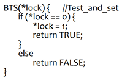

Acá, pregunta por la variable `lock`. Si es 0 la define en 1 y devuelve `TRUE` y, si no es igual a cero, devuelve `FALSE`. Entonces, lo que hace test and set es preguntar y asignar un valor, todo en una misma instrucción. Pero el *Test and Set* no nos resuelve el problema completamente. Vamos a seguir teniendo que usar un `while` (lo que indica que esta solución tiene escucha activa) pero por lo menos vamos a asegurar la mutua exclusión.

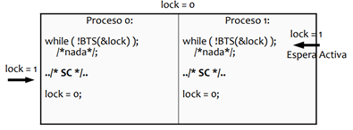

Comenzamos con una variables compartida `lock` que le va a indicar a cada proceso si puede o no entrar a la sección. `lock = 0` indica que la sección critica está disponible. Comienza el P0 y ve que lock es igual 0, entonces BTS lo pone en 1 y devuelve true. Como el ! del `while` lo vuelve falso, salgo del `while` y accedo a la sección critica. Como todo esto ocurre en una única instrucción, el problema de que se interrumpa el programa en el medio no puede ocurrir más.

**Características**:

- No provoca la alternancia en la ejecución de los procesos.

**Ventajas**:

- Resuelve el problema de la mutua exclusión y el progreso.

**Problemas**:

- Tiene espera activa

#### Soluciones de SO

Los SOs proveen una herramienta, los *semáforos*, que sirven tanto para trabajar con la mutua exclusión como para sincronizar u ordenar la ejecución de distintos procesos. También permiten limitar o controlar la cantidad de accesos a un recurso.
Se implementan mediante dos *llamadas al sistema*: `wait()` y `signal()` (además de las llamadas al sistema que se usan para crearlos y eliminarlos). Vamos a ver cómo se está conformado un semáforo y qué hacen estas funciones:

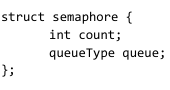

El struct está compuesto por un int que puede tomar cualquier valor y por una lista de procesos bloqueados.

Vamos a ver que hacen `wait()` y `signal()`.

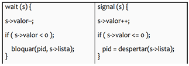

- `wait()`: decrementa el valor del semáforo en 1. Después pregunta si el valor del semáforo es menor que 0. Si lo es, el proceso que está haciendo el `wait` se va a bloquear.
- `signal()`: Incrementa el valor del semáforo en1. Después pregunta si el valor del semáforo es menor o igual a 0. Si lo es, desbloquea a alguno de los procesos que estaban bloqueados.

**Valores de un semáforo**:

- Valor de inicialización: siempre es un valor positivo o cero. Nunca puede inicializarse en un valor negativo.
- Si es mayor a 0: representa la cantidad de instancias disponibles de un recurso.
- Si es menor a cero: representa la cantidad de procesos/hilos bloqueados en espera a ser llamados.
- Si es cero: quiere decir que no hay disponibilidad y tampoco nadie en espera.

**Utilidades**:

- Mutua exclusión: Se utiliza un semáforo llamado *mutex*. Cuando un procesos quiera entrar a la sección critica hace un `wait()` y cuando sale hace un `signal()`

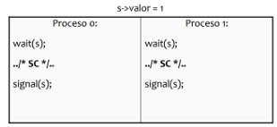

- Sincronización de procesos: se utiliza un semáforo *binario*. Supongamos que queremos que una sección de código de un proceso se ejecute necesariamente después de que se ejecute otra sección de otro proceso. Como no sabemos en qué orden el SO va a designar a los procesos el uso de la CPU, necesito que los procesos estén sincronizados.

En este ejemplo tenemos dos semáforos, `s = 1` y `q = 0`. Ahora, para entender cómo funciona supongamos los dos casos:

- Comienza P0: se hace un wait de s y su valor pasa a 0. Se ejecuta la sección de código en cuestión y se señala al semáforo q, quedando su valor en 1. Cuando ejecute el P1, va a hacer un wait de q y su valor va a quedar en 0. Va a ejecutar su código normalmente y, cuando termine, va a señalar a s.
- Comienza P1: con q inicialmente en 0, al hacer un wait su valor quedará en -1. Al ser un valor menor a 0, se va a bloquear al proceso que hizo el wait: O se, se va a bloquear a P1 y va a permanecer bloqueado hasta que el P0 haga un signal de q que lo despierte. Esto garantiza que siempre van a ejecutar en orden P0,P1,P0,... 
  
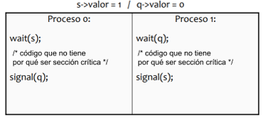

- Controlar accesos a recursos (n instancias): declaramos un semáforo con un valor igual a la cantidad de instancias de un recurso. Supongamos un recurso con 3 instancias. El primer recurso que se solicite dejará al semáforo en 2. Luego, si otro proceso solicita una instancia quedará el semáforo en 1. Y cuando venga otro proceso tomará el último recurso y dejará el semáforo en0. El tema es que cuando llegue un nuevo proceso. Al hacer el wait, el semáforo bloqueará al proceso y lo agregará a la cola de procesos bloqueados (o, procesos en espera para usar el recurso). El valor del semáforo será -1.

**Tipos de semáforos**:

- Contador/general: permite controlar el acceso a una cantidad de recursos. Se inicializa en un valor mayor a 0, específicamente en n (siendo n la cantidad de instancias totales del recurso).
- Binario: permite garantizar un orden de ejecución. Representa libre u ocupado. Se inicializa en 0 o 1. También puede usarse para proteger recursos pero se usa de forma diferente (nunca sabremos cuantas instancias tenemos disponibles, ni cuántos procesos están bloqueados, sólo sabremos cuándo hay recursos disponibles y cuando no).
  - Mutex: es una variante del binario utilizada para garantizar la mutua exclusión sobre un recurso o sección critica. Siempre se inicializa en 1 y resuelve el problema de condición de carrera.

**¿Pueden ser interrumpidos los semáforos?**
Si y no. Wait y siganl deben implementar alguno de los métodos que vimos (de software/hardware) para garantizar que, en caso de ser interrumpidos, no afecten el funcionamiento de los semáforos. En caso de que la solución sea deshabilitar las interrupciones (que tanto wait como signal pueden hacerlo dado que ambas se ejecutan en modo kernel), se dirá que son atómicas, es decir, se ejecutan por completo en un ciclo de instrucción o no se ejecutan. No pueden ser interrumpidas.

**Orden de la cola de bloqueados de un semáforo**: el algoritmo FIFO parece ser el más justo y es el que vamos a usar en los ejercicios aunque puede usarse otro tipo de planificación

#### Soluciones de los lenguajes de programación

Son soluciones provistas por los lenguajes orientados a objetos haciendo uso del encapsulamiento. Un monitor va a ser una clase que va a permitir que únicamente un proceso ejecute en el monitor a la vez. Cuando ejecute, va a poder ejecutar cualquiera de los procedimientos definidos en el monitor. Los demás procesos permanecerán en el área de espera.
El monitor posee datos locales que sólo él puede modificar. Si un proceso quiere hacer uso de estos datos, deberá invocar a alguno de los procedimientos del monitor. De estar disponible, lo ejecutará, de otra forma, pasará al área de espera.

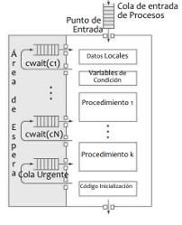

**Ventajas**:

- Promueve la mutua exclusión
- Permite sincronizar procesos

### Productor y consumidor

1. Identificamos que el buffer es un recurso compartido entre el productor y el consumidor. El productor agrega y el consumidor quita, por lo que los dos procesos modifican al recurso. Es entonces una sección critica. Entonces tenemos que usar un semáforo mutex para garantizar la mutua exclusión sobre el buffer. Como es un buffer lo inicializamos en 1. `s_buffer = 1`
2. Ahora nos damos cuenta de otra cosa: queremos que el productor ejecute primero (porque si el buffer está vacío al consumidor no le serviría). Es decir, queremos que cuando el consumidor quiera consumir haya algo en el buffer. Vamos a necesitar 2 semáforos. Un semáforo va a representar "*agregué elementos al buffer entonces hay cantidad suficiente para que puedas consumir*" y otro que represente "*hay x lugares disponibles e el buffer para que pongas más elementos*"

- `s_lugar = N` (porque al principio ha N lugares disponibles en el buffer). Este es, justamente, un semáforo de tipo contador que mide la cantidad de lugares (recursos) disponibles.
- `s_cant = 0` (porque al principio no hay elementos en el buffer)