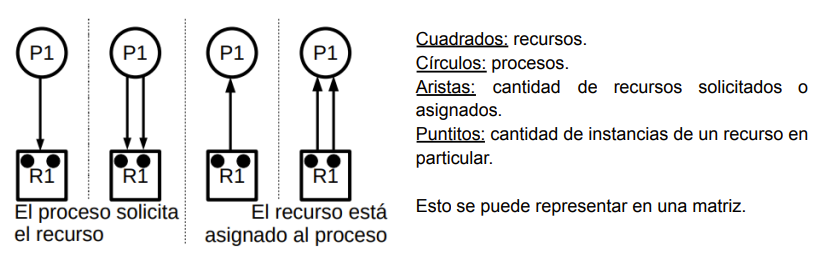
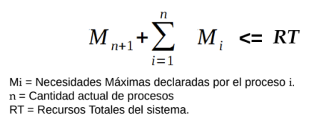

# Deadlock

---

El *Deadlock* es el bloqueo permanente de un conjunto de proceso donde cada uno de estos procesos está esperando un evento que sólo puede generar un proceso del conjunto. Es una consecuencia de la mala sincronización o un mal uso de los recursos compartidos entre procesos.

- *Recursos limitados*: los procesos los solicitan, usan y finalmente libera. Si el proceso necesita un recurso y no está disponible, se bloquea hasta que el recurso se encuentre disponible. Hay varios recursos:
  - *Gestionados por el SO* (generalmente no necesitan ningún tipo de gestión por parte de los desarrolladores).
  - *No gestionados por el SO*: En estos casos es donde se puede dar el deadlock
- *Tipos de recursos*:
  - Reutilizables: un proceso lo solicita, lo utiliza y lo libera para que lo use otro proceso. Por lo general vamos a trabajar sobre estos.
  - Consumibles: puede ser utilizado una vez y luego "desaparece", se consume. No hay "espera", quien toma el recurso lo utiliza y listo.

## Grafo de asignación de recursos

Es una herramienta que tenemos para empezar a analizar el problema de deadlock. EL grafo me muestra, para un determinado instante, cómo es la asignación de recursos

**Ejemplo**:

*Como ver el deadlock en el grafo*:

- Si no hay ciclos $\rarr$ no hay deadlock
- Si hay un ciclo $\rarr$ podría o no haber deadlock
- Si hay un ciclo y todos los recursos implicados en ese ciclo tienen una sola instancia $\rarr$ podría o no haber deadlock

*No se puede justificar la existencia de deadlock mediante el grafo, hay que usar un algoritmo*.

## Condiciones para la existencia de deadlock

**Condiciones necesarias**:

- *Que existen mutua exclusión*: es decir, que un recurso deba ser usado únicamente por un único proceso/hilo en todo instante.
- *Que haya retención y espera*:Un proceso toma ciertos recursos, los retiene y pide nuevos recursos. No va a liberar los viejos hasta que no le den los nuevos (GOD ENERGY)
- *Que no haya desalojo de recursos*: si el SO pudiera sacarle a un procesos un recurso que está reteniendo, habría desalojo de recursos. Cuando no hay desalojo, es el mismo proceso el que retendrá el recurso hasta que decida liberarlo.

**Condiciones necesarias y suficiente**:

- Las tres mencionadas anteriormente
- *Espera circular*: Cada proceso/hilo está bloqueado esperando un evento que lo dé otro proceso que está dentro de esta espera, esperando lo mismo.

## Cómo lidiar con un deadlock

### Alternativa 1 - prevenirlo:

- Garantiza que no ocurrirá deadlock.
- Se encarga de impedir que se produzca alguna de las cuatro condiciones necesarias y suficiente para que exista deadlock. Con que una no se cumpla, es suficiente para que no ocurra deadlock en un sistema
  - *Mutua exclusión*: no siempre puede evitarse. Si hay recursos que no se pueden compartir no puede evitarse
  - *Retención y espera*: el proceso debe solicitar todos los recursos que va a utilizar de forma simultánea, y si alguno de los mismos no está disponible, la totalidad de la solicitud es denegada.
  Lo malo de está solución es que si un proceso que ejecuta durante mucho tiempo tiene asignados recursos que va a usar durante un periodo muy corto de tiempo y no los libera, hay una ineficiencia de esos recursos. Esto puede generar **inanición** en otros procesos.

  - *Desalojo de recursos*: "Si un proceso A solicita un recurso que está asignado a otro proceso B (que está a la espera de más recursos), el recurso asignado al proceso B puede asignarse al proceso A, dado que B está esperando y no lo está usando
  Para implementar esto los procesos deben poder ser retrotraídos a un estado previo consistente y deben disponer de un mecanismo para ser notificados que les fue des-asignado un recurso

  - *Espera circular*: asignar un número de orden a los recursos. Los recursos sólo pueden solicitarse en orden creciente. La idea sería que un proceso sólo puede solicitar recursos que sean mayor (en número) al recurso que tenga asignado en ese momento.
  Habiendo ocurrido un deadlock, si el SO expropia recursos a un proceso de manera que la espera circular desaparezca, podía de todas maneras volver a producirse la misma espera circular y generar 

### Alternativa 2 - Evasión o predicción de deadlock

Se trata de dos técnicas que garantizan que no ocurra deadlock

- *Denegar el inicio de un proceso*: Se le va a denegar el inicio a un proceso si está pidiendo más recursos de los totales.

- *Denegar la asignación de un recurso - algoritmo del banquero*: Se va a jugar con la cantidad de recursos que un proceso quiere y los que tiene asignados. Se evalúa la solicitud de recursos que hace un proceso, se simula esa asignación y se ve si se termina en un estado seguro o inseguro. Si el estado final es seguro, la solicitud es aceptada.
  - Estado seguro: no habrá deadlock. Se le asigna el recurso al proceso.
  - Estado inseguro: podría existir deadlock si se le asignara el recurso al proceso. No se le asigna el recurso al proceso.
- *Algoritmo para ver si estoy en estado seguro*:
  1) Me dan la matriz de Necesidades Máximas y la de Recursos Asignados. Las resto y obtengo la matriz de Necesidades Pendientes.
  2) Calculo el vector de Recursos Disponibles.
  3) Si hay algún proceso que no tenga necesidades pendientes lo finalizo para que libere los recursos que tiene asignados.
  4) Me fijo que otros procesos pueden finalizar y liberar recursos.
  5) Si todos los procesos pueden finalizar y me quedo con todos los recursos totales entonces existe Secuencia Segura, está en Estado Seguro
- *Algoritmo para simular asignación de recursos*: es lo mismo que el anterior pero el enunciado va a decir, por ejemplo, "puede P2 solicitar 2 instancias de R2?. Lo que tengo que hacer es simular esa asignación y ver si llega a un estado seguro. Para esto:
  1) Me fijo si lo que está solicitando está dentro de las peticiones pendientes (si se pasa no sería coherente).
  2) Me fijo si hay recursos disponibles para asignarle los que está pidiendo. Seguramente haya, entonces se los asigno. Ahora, con esa asignación el proceso probablemente no finalice (porque falta que se le asignen más recursos para cumplir todas sus necesidades pendientes) así que no me va a liberar ningún recurso. Construyo la matriz de Necesidades Pendientes teniendo en cuenta la asignación que acabo de hacer.
  3) Me fijo si todos los procesos pueden finalizar. Si pueden entonces se le asignarán los recursos al P2 y sino no.

### Alternativa 3 - Detección y recuperación de deadlock

- Puede ocurrir deadlock. De hecho, dejamos que ocurra el deadlock y luego aplicamos un mecanismo de recuperación para arreglarlo.
- No hay restricciones para asignar recursos disponibles. Un proceso pide algo y se lo damos.
- Periódicamente se ejecuta el Algoritmo de Detección para determinar la existencia de deadlock
  
  *Opciones de recuperación*: estamos en deadlock, ¿Qué podemos hacer para solucionarlo? alguna de las siguientes opciones:
  
  - Matar a los procesos involucrados en el deadlock
  - Volver a un estado anterior. Es muy complejo de implementar.
  - Identificar los procesos involucrados en el deadlock, matar uno a uno hasta que no haya más deadlock. No se matan a todos de una como en la primera alternativa, se mata a uno, se ve si hay deadlock; si hay, se sigue matando hasta que no haya más deadlock.
  - Identificar a los procesos que son parte del deadlock y sacarles los recursos hasta que no exista deadlock.

*Criterios de selección de procesos para terminar o expropiar*:

1) Menor tiempo de procesador consumido.
2) Menor cantidad de salida producida.
3) Mayor tiempo restante estimado.
4) Menor número total de recursos asignados.
5) Menor prioridad.

*Algoritmo de detección de deadlock*: no necesita conocer la matriz de necesidades máximas de los procesos.

1) Si no me dieron el vector de Recursos Disponibles lo calculo restando a los recursos totales los asignados.
2) Tacho de la matriz de Recursos Asignados a aquellos procesos que no tengan recursos asignados. También lo tachamos de la matriz de Peticiones.
3) Finalizo a los procesos que no estén peticionados recursos y sumo sus recursos a los Recursos Disponibles.
4) Con el array de Recursos Disponibles me fijo qué proceso puede finalizar
5) Finalizo a ese proceso incorporado a los Recursos Disponibles los recursos que tenía asignado ese proceso.
6) Hago esto hasta que no pueda finalizar ningún otro proceso. Esos van a ser los procesos que están en deadlock.

*Desventajas de esta estrategia*:

- Esta estrategia no puede aplicarse en aquellos sistemas donde no podemos permitir que ocurra un deadlock
- Recuperar el deadlock (matando a los procesos involucrados en el deadlock) puede tener un impacto negativo para las víctimas

### Alternativa 4 - No tratarlo

¿Por qué tendríamos necesidad de recuperarnos del deadlock? La mayoría de los SO no tratan los deadlocks.
