# Memoria Real

## Introducción

- Un programa debe cargarse en memoria desde disco y colocarse dentro de un proceso para que se ejecute.
- La memoria principal y los registros son los únicos dispositivos de almacenamiento a los que puede acceder la CPU directamente.
- El acceso a registro es muy rápido; supone un siclo de CPU (o menos)
- El acceso a memoria principal puede durar varios ciclos
- Las memorias **caché** se colocan entre la memoria principal y la CPU para acelerar el acceso a la información

## Organización física de la memoria.

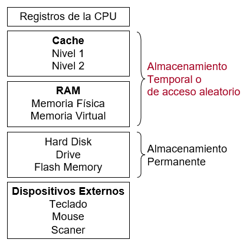

## Organización lógica de la memoria

- La memoria principal es un arreglo de palabra o bytes, cada uno de los cuales tiene una dirección (espacio de direcciones).
- La interacción es lograda a través de un conjunto de lecturas y escrituras a direcciones especificas realizadas por los procesos.

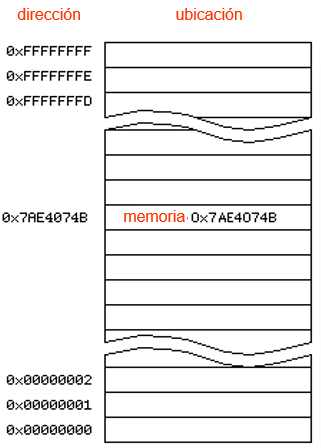

## Procesos y Memoria

- Para que un proceso se ejecute se requiere ubicarlo en memoria principal junto con los datos que direcciona.
- Para optimizar el uso del computador se requiere tener varios procesos en memoria principal. (grado de multiprogramación)

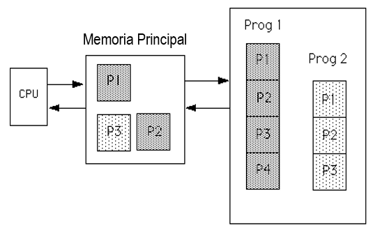

# Memoria Virtual

La memoria principal es pequeña como para acomodar todos los programas y datos permanentemente. Por lo que es necesario implementar mecanismos de *memoria virtual*. La *memoria virtual* es una técnica para dar la ilusión de tener más memoria que la memoria principal.

## Vinculación de direcciones

La vinculación de instrucciones y datos a direcciones de memoria puede realizarse en tres etapas diferentes:

- **compilación**: Si se conoce a priori la posición que va a ocupar un proceso en la memoria se puede generar **código absoluto** con referencias absolutas a memoria; si cambia la posición del proceso hay que recompilar el código.
- **Carga**: Si no se conoce la posición del proceso en memoria en tiempo de compilación se debe generar **código reubicable**
- **Ejecución**: Si el proceso puede cambiar de posición durante su ejecución la vinculación se retrasa hasta el momento de ejecución. Necesita soporte hardware para el mapeo de direcciones (ej: registro base y limite).

## Espacio de Direcciones

El concepto de espacio de *direcciones lógicas* vinculado a un *espacio de direcciones físicas* separado es crucial para una buena gestión de memoria.

- **Dirección lógica** - es la dirección que genera el proceso; también se conoce como *dirección virtual*.
- **Dirección física** - dirección que percibe la unidad de memoria.

Las direcciones lógicas y físicas son iguales en los esquemas de vinculación en tiempo de compilación y de carga; pero difieren en el esquema de vinculación en tiempo de ejecución

## Base y límite

Un par de registros **base** y **límite** definen el espacio de direcciones lógicas

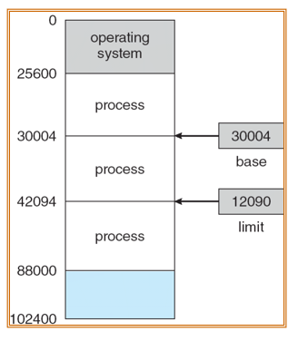

# Memory Managment Unit (MMU)

La *MMU* es un dispositivo hardware que transforma las direcciones virtuales en físicas. Con la MMU el valor del registro *reubicado* (registro base) es añadido a a cada dirección generada por un proceso de usuario en el momento en que es enviada a la memoria.
El programa de usuario trabaja con direcciones *lógicas*, nunca ve las direcciones *físicas* reales.

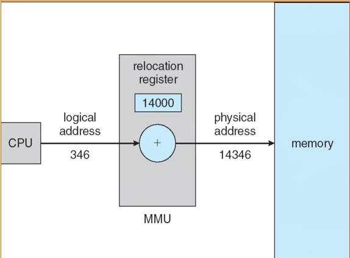

## Administrador de memoria

| *Sistema monoprogramado* | *Sistema multiprogramado* |
|   -                      |   -                       |
|Un programa puede o no ingresar a una única partición de memoria | Múltiples programas comparten diversas particiones de memoria. Pueden ser particiones de tamaño fijo o particiones de tamaño variable|
|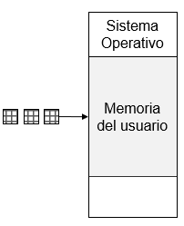 |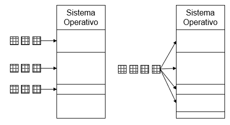|

### Requisitos del administrador de memoria

1) Reubicación: Permitir el recalculo de direcciones de memoria de un proceso reubicado.
2) Protección: Evitar el acceso a posiciones de memoria sin el permiso expreso (no direcciones absolutas)
3) Compartición: Permitir a procesos diferentes acceder a la misma porción de memoria
4) Organización Lógica: Permitir que los programas se escriban como módulos compilables y ejecutables por separado.
5) Organización Física: Permitir el intercambio de datos en la memoria primaria y secundaria.

### Estrategias

Están dirigidas a la obtención del mejor uso del recurso memoria principal, estás pueden ser:

1) Estrategia de solicitud (búsqueda)
(Cuando obtener un fragmento de programa)

   - Estrategias de búsqueda por demanda.
   - Estrategias de búsqueda anticipada.

2) Estrategia de ubicación
(Donde se colocará (cargar) un fragmento de programa nuevo)

3) Estrategia de reposición.
(Qué fragmento de programa descarga, para cargar uno nuevo)

#### Técnicas para administrar memoria

##### 1. Partición Fija

La memoria principal se divide en un conjunto de particiones de tamaño fijo durante el inicio del sistema.
Un proceso se puede cargar completamente en un partición de tamaño menor o igual.

- Ventajas:
  - Sencilla de implementar
  - Poca sobrecarga al SO
- Desventaja:
  - Fragmentación interna
  - Nro. fijo de procesos activos

###### Estrategias de la partición fija

- Solicitud.
  - Por demanda
- Ubicación.
  - Partición de igual tamaño: Si el proceso cabe en una partición se puede cargar
  - Partición de diferente tamaño: Asignar a la partición más pequeña
- Reemplazo.
  - Uno de los procesos se saca, según el planificador.

|Particiones del mismo tamaño|Particiones de distinto tamaño|
|-|-|
|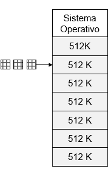|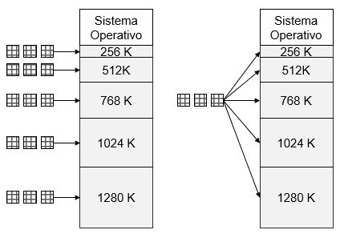|

Si un programa no cabe en una partición, el programador debe diseñarlo en módulos cargables.

El uso de memoria es muy ineficiente, no importa el tamaño del proceso, ocupara toda la partición, se genera fragmentación interna.

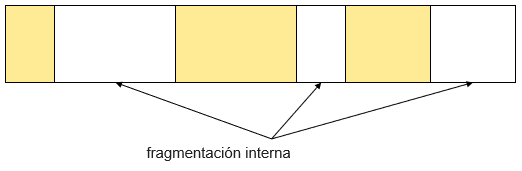

##### 2. Partición Dinámica

Las particiones se crean dinámicamente por demanda. Son variables en tamaño y número.
Cada proceso se carga completamente una única partición del tamaño del proceso.

- Ventajas:
  - No existe fragmentación interna.
- Desventajas:
  - Fragmentación externa
  - Se debe compactar la memoria
  - El compactado toma tiempo

El uso de memoria es muy ineficiente, se generan muchos huevos entre las particiones, cada vez más pequeñas. Se genera la fragmentación externa.

Cada cierto tiempo se debe compactar los segmentos libres, para que estén contiguos.

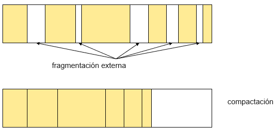

###### Estrategias de la partición dinámica

- Solicitud:
  - Por demanda
- Ubicación
  - *Primer ajuste*: El primer bloque disponible (parte del inicio)
    - Es bueno, con baja compactación. Puebla el inicio de la memoria
  
  - *Siguiente ajuste*: El siguiente bloque disponible que ubique (parte desde la ubicación actual)
    - Puebla el final de la memoria, el siguiente bloque libre siempre está al final de la memoria.

  - *Mejor ajuste*: El bloque disponible que deje el menor espacio libre (búsqueda exhaustiva)
    - Tiene peores resultados, dado que busca la partición que deje el hueco más pequeño, la memoria se llena de huecos pequeños. Se compacta con más frecuencia

  - *Peor ajuste*: Se asigna el hueco **más grande**, hay que buscar en la lista completa de huecos (salvo si está ordenada por tamaño)
- Reemplazo
  - Uno de los procesos se saca, según el planificador.

##### 3. Paginación Simple

La memoria principal se divide en un conjunto de marcos de igual tamaño. Cada proceso se divide en una seria de páginas del tamaño de los marcos.
Un proceso se carga en los marcos que requiera (todas las páginas), no necesariamente contiguos.

- Ventajas:
  - No hay fragmentación externa
- Desventajas:
  - Fragmentación interna pequeña

El SO mantiene una tabla de paginas para cada proceso, que contiene la lista de marcos para cada pagina.

Una dirección de memoria es un número de página (P) y un desplazamiento dentro de la página (W).

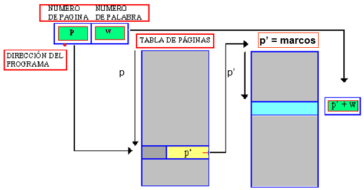

###### Estrategias de la paginación simple

- Solicitud:
  - Por demanda
- Ubicación:
  - Se cargan todas las páginas de un proceso en los marcos libres y se actualiza su tabla de páginas
- Reemplazo:
  - Una de las páginas se puede sacar y se marca que no está cargada. Esto es posible por que cada proceso tiene su propia tabla de páginas.
  - No es necesario sacar todas las páginas de un proceso.

###### Traducción de direcciones

Una dirección generada por un proceso es dividida en:

- **Página ($p$)** usando como índice en la tabla de páginas que contiene la dirección base de cada página en memoria física.
- **Desplazamiento ($d$)** se combina con la dirección base para definir la dirección de memoria física que se envía a la unidad de memoria

###### Capacidad de direccionamiento

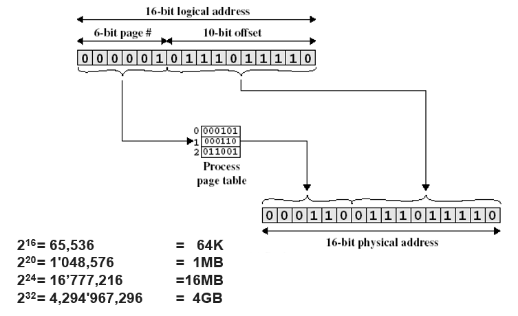

###### Ejemplo de Paginación

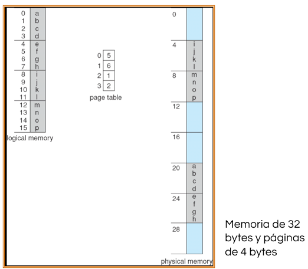

###### Marcos Libres

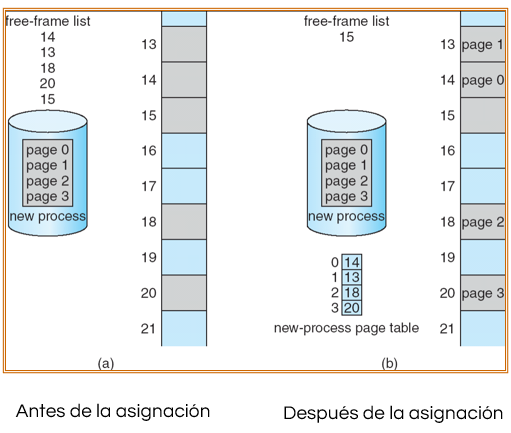

###### Tabla de Páginas

- La tabla de páginas se mantiene en memoria principal.
- El **registro base de la tabla de páginas (PTBR)** apunta al inicio de la tabla de páginas
- El **registro longitud de la tabla de páginas (PRLR)** indica el tamaño de la tabla de páginas

En este esquema cada acceso a dato o instrucción requiere dos accesos a memoria. Uno para la tabla de páginas y otro para obtener el dato o instrucción.

Se puede agilizar el proceso usando una pequeña memoria asociativa o **TLB (translation look-aside buffer)**

###### Memoria Asociativa

- Memoria Asociativa - búsqueda en paralelo

| # Página | # Marco |
|-|-|
|||
|||
|||

**Traducción de direcciones (p,d)**:

- Si p está en un registro asociativo se obtiene el número de marco
- Si no, se obtiene el número de marco de la tabla de páginas que está en memoria principal.

###### HW de Paginación con TLB

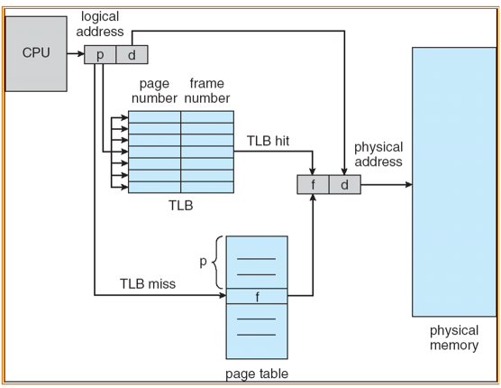

###### Tiempo de acceso efectivo

- Busqueda asociativa = $\epsilon$ unidades de tiempo
- Acceso a memoria = $m$
- Tasa de acierto $\rarr$ probabilidad de encontrar una página en los registros asociativos
  - Depende de las peticiones de páginas y el número de registros asociativos
- Tasa de acierto = $\alpha$
- **Tiempo de acceso efectivo** (Effective Access Time, EAT)
  $EAT = (M+\epsilon)\alpha+(2m+\epsilon)(1-\alpha)=2m-\alpha m + \epsilon$

###### Protección de la memoria

La protección de la memoria se implementa asociando un bit de protección con cada página. Hay un **bit de validez** en cada entrada de la tabla de páginas:

- *Válido* indica que la página asociada está en el espacio de direcciones lógico del proceso, y por lo tanto es legal el acceso.
- *Inválido* indica que la página no está en el espacio de direcciones lógico del proceso 

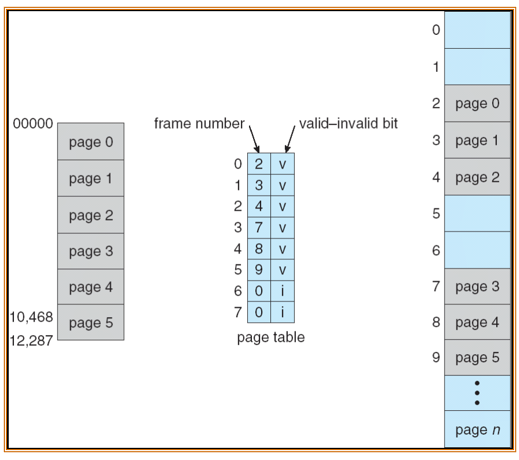

###### Tabla de páginas multinivel

Divide el espacio de direcciones lógicas en múltiples tablas de páginas

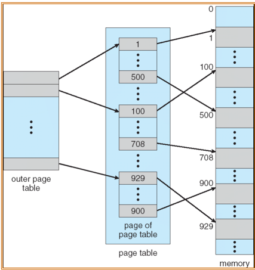

###### Ej de paginación de 2 niveles

Una dirección lógica (en una máquina de 32 bits con tamaño de páginas de 4k) se divide en:

- Un número de páginas de 20 bits
- Un desplazamiento dentro de la página de 12 bits

Ya que la tabla de páginas está paginada y cada entrada de la tabla de páginas ocupa 4 bytes, el número de página es de nuevo dividido en:

- Un número de página de 10 bits
- Un desplazamiento de 10 bits

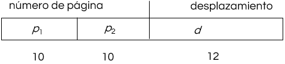

Donde $p_1$ es un índice en la tabla externa y $p_2$ es un desplazamiento en la segunda tabla de páginas.

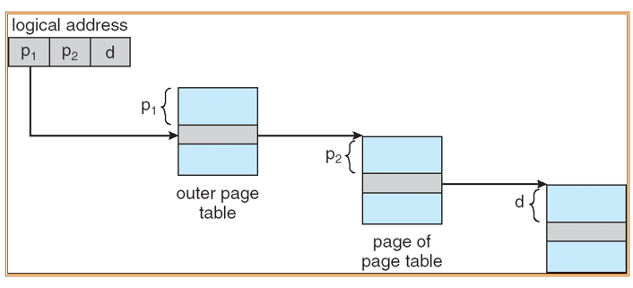

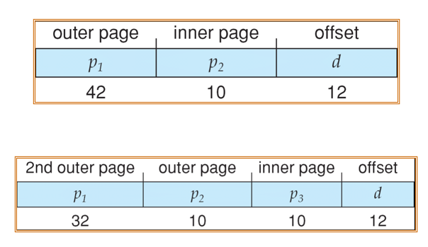

###### Tabla de páginas invertida

Es una entrada por cada *marco* de memoria. Las entradas contienen la dirección virtual de la página almacenada en el marco con información sobre el proceso que la posee.
Disminuye la memoria necesaria para almacenar cada tabla de páginas pero aumenta el tiempo requerido para buscar en la tabla cuando ocurre una referencia a memoria.
La solución es usar una tabla hash para limitar la búsqueda a una entrada (o unas pocas como mucho).

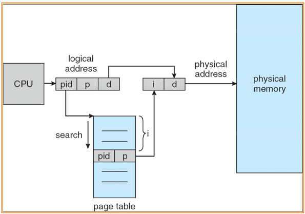

##### 4. Segmentación Simple

Cada proceso y sus datos se dividen en segmentos de longitud variable. Un proceso carga sus segmentos en particiones dinámicas no necesariamente contiguas.
Todos los segmentos de un proceso se deben cargar en memoria.
Se diferencia de la partición dinámica en que un proceso puede ocupar más de un segmento.

- Ventajas
  - No hay fragmentación interna
- Desventajas
  - Fragmentación externa, pero menor (compactación)

El SO mantiene una tabla de segmentos para cada proceso y la lista de bloques libres.
Una dirección de memoria es un *número de segmento (S)* y un *desplazamiento dentro de segmento (W)*.

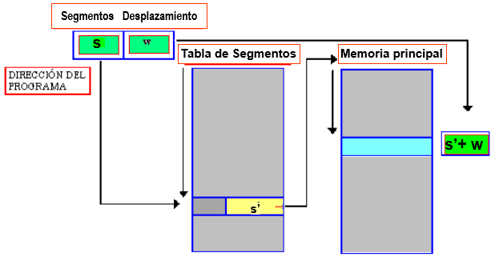

###### Estrategias de la segmentación simple

- Solicitud
  - Por demanda
- Ubicación
  - Se cargan los segmentos de un proceso en los bloques libres y se actualiza su tabla de segmentos.
- Reemplazo
  - Uno de los segmentos se puede sacar y se marca como que no está cargado. Esto es posible porque cada uno de los procesos tiene su tabla de segmentos

###### Segmentación

Es un esquema de gestión de memoria que apoya la visión que el usuario tiene de la memoria.

- Un programa es una colección de segmentos.
- Un segmento es una unidad lógica.

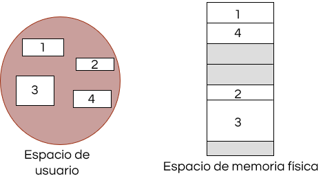

###### Esquema de segmentación

- Una dirección lógica consiste en un par:
  < número de segmento,desplazamiento >
- **Tabla de segmentos**: Contiene información sobre la ubicación de los segmentos en memoria; cada entrada tiene:
  - **base**: contiene la dirección física en la que comienza el segmento
  - **límite**: especifica la longitud del segmento
- El **registro base de la tabla de segmentos (STBR)** apunta a la localización en memoria de la tabla de segmentos.
- El **registro de longitud de la tabla de segmentos (STLR)** indica el número de segmentos usados por un programa
- El número de segmentos **$s$** es legal si **$s$ < STLR**
- Protección
  - En cada entrada de la tabal de segmentos hay:
    - Privilegios de lectura/escritura/ejecución
    - Set de instrucciones permitidas
    - Nivel de privilegio
- Los bits de protección están asociados con los segmentos; la compartición de código ocurre a nivel de segmento.
- Ya que los segmentos varían en longitud, la asignación de memoria es un problema de asignación dinámica

###### Validación del direccionamiento

- No hay correspondencia entre dirección lógica y dirección física.
- El SO trabaja con direcciones lógicas.
- El SO debe asegurar que cada dirección lógica esté dentro del rango de direcciones del proceso
- El SO implementa la tabla de segmentos como un arreglo de registros base y limite

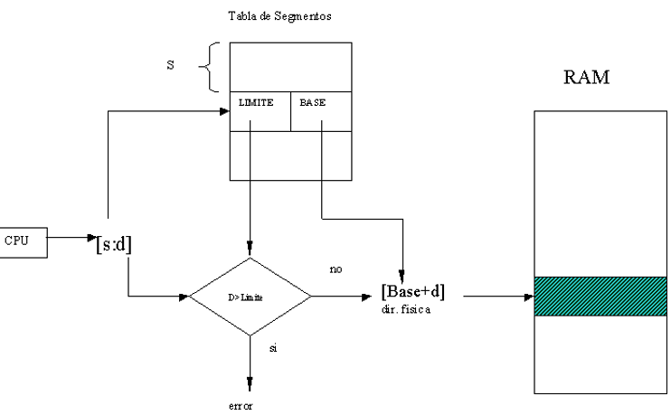

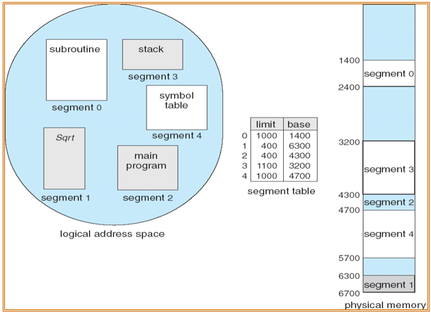

##### Segmentación con Paginación

La paginación y la segmentación se pueden combinar en la segmentación con paginación.
En este esquema de gestión de memoria los segmentos se paginan.

- Se apoya la visión de la memoria que tiene el usuario
- Se resuelve el problema de la asignación dinámica
- Es necesario una tabla de segmentos y una tabla de páginas por cada segmento
- La traducción de direcciones es más compleja y puede requerir mayor número de accesos a memoria en el peor caso

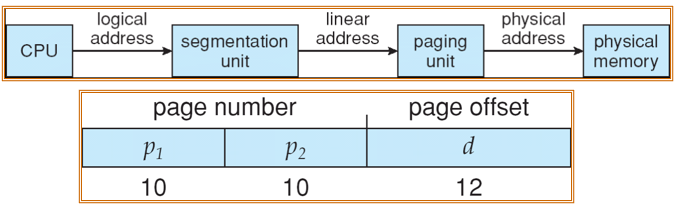

