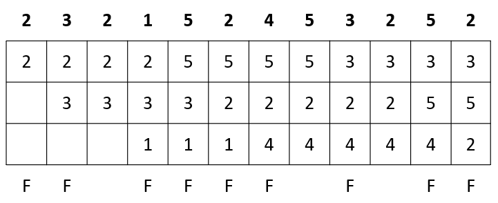
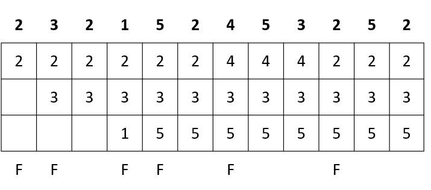
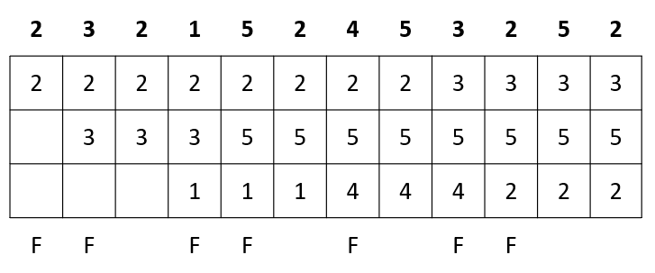
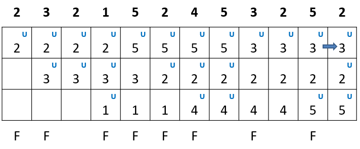
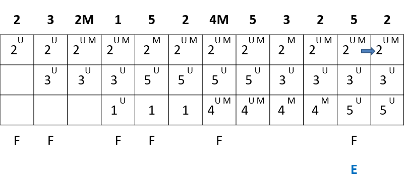

# Memoria Virtual

- Inicialmente se usaba el **Overlaying**

La memoria virtual es tomar la principal, y extenderla usando un poco el espacio del disco. Si bien el disco es más lento, es un sacrificio que me permite ampliar mi almacenamiento

Un proceso puede estar en Memoria principal o en Swap, o bien, dividido entre ambos

## Localidad

La localidad es u set de paginas que se utiliza en conjunto. Los procesos utilizan diferentes localidades durante su ejecución

Localidad temporal: Si en un momento estoy accediendo a una posición de memoria, es probable que en un futuro vuelva a accederla. Es decir, si para decidir que pieza de información quiero tener en MP o en disco, verifico cuando fue la ultima vez que se usó (aging)

Localidad espacial: Si estoy accediendo a alguna posicion de memoria, es muy probable que tambien acceda da las posiciones de memoria contiguas.

## Paginación por demanda

Las paginas se cargan en memoria físico sólo cuando se necesitan.
El swapping es "lazy". Se mueven sólo las páginas que se necesitan
Agrego un bit de "presencia" a la tabla de paginación que verifica si efectivamente está cargada en MP no. Además se agrega el bit de modificado, para saber si el proceso fue utilizado para guardarla o simplemente puedo cambiarlo.

Los frames serian los espacios de memoria asignados.

## Politicas de proceso

- Asignación
  - Fija
    - Le asigno una cantidad fija de frames y no varia
  - Dinamica
    - La cantidad de frames puede variar
- Sustitución
  - Local
    - Cada proceso solo puede cambiar los frames de ese mismo proceso
  - Global
    - Cuando cargo un frame de un proceso puede elegir la tabla de cualquier otro proceso 

## Trashing

Cuando un proceso intenta ejecutar y no tiene el frame en MP se llama fallo de pagina (page fault)

Si un proceso constantemente pierde constantemente sus frames, va a perder mucho tiempo tratando de traer los procesos de memoria virtual a principal, porque la localidad de sus paginas no están en memoria principal, provocando una disminución de la efectividad.

Los procesos realizan acciones de paginación en lugar de trabajo productivo.
Como todos los proceso requieren de la MMU, se bloquearán esperando ser atendidos por la misma haciendo que caiga el uso de CPU y aumente el tiempo de acceso efectivo a memoria.

Una solución es cambiar la logica en la que se asignan los frames.

- Paginación vaga: Está todo el proceso guardado en SWAP (Memoria virtual) y al principio de los procesos cargo todo el proceso en MP
- Pre-paginación: El proceso se va cargando preventivamente desde SWAP hacia MP. Se trata de predecir que va a necesitar el proceso para cargarlo anticipadamente. Si le sobra memoria se carga aún más data.
- Lock de páginas durante E/S: Se  bloquean las páginas durante la transferencia de E/S
- Buffer de páginas: Tener un espacio donde se carga la información y en vez de esperar que se libere la tabla de paginas utilizo el buffer.

## Algoritmos de carga de paginas

Suponemos que un proceso pide paginas durante su ejecución

### FIFO

La primera página que ingresó es la seleccionada para el reemplazo

### Óptimo

Reemplaza la página cuya próxima referencia es la más lejana.

No aplicable, porque no sé que páginas voy a utilizar a futuro. Se utiliza como criterio para ver cual algoritmos es más cercano al óptimo

## LRU

Verifico cual es el frame que se accedió hace más tiempo y la reemplazo

## Clock

- Se utiliza un **bit de uso**(U) asociado a cada página
- Cuando una página es cargada en un marco, el bit se inicializa U=1
- Si la página es referenciada, entonces U=1

Si el marco se selecciona para ser reemplazada, se analiza el valor de U

- Si U=1 -> Cambio U=0 y sigo buscando
- Si U=0 -> reemplazo la página

## Anomalia de Belady

Por lo general al agregar mayor cantidad de frames en general disminuye la cantidad de fallos de páginas
Salvo para algunos casos de FIFO

## Clock Mejorado

Junto con el bit de uso U, agregamos el bit de modificado M.

Reemplazo el que tenga en bit de uso U=0 y el de modificado M=0

Priorizo las páginas que tengan el Modificado en 0. Si no encuentro ninguno desempata el bit de uso.

