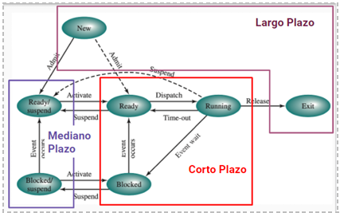
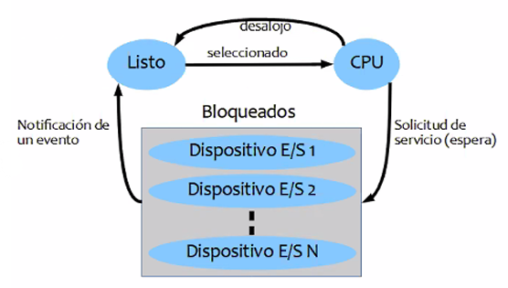
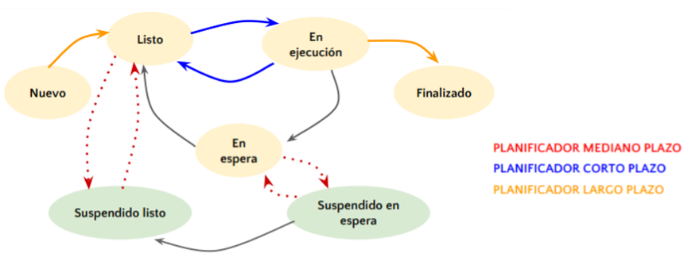

<h1>Planificación</h1>

**Problemas de la multiprogramación**: cuando hay muchos procesos queriendo ejecutar al mismo tiempo, se puede car en alguno de los siguientes casos:

- Disparidad de tiempo en el uso de la CPU
- Procesos que no llegan a ejecutarse nunca
- Degradación del tiempo de respuesta del sistema.
- Memoria RAM llena y CPU sin utilizarse.

La clave para no caer en estos escenarios es la coordinación (planificación/scheduling).

**Nivel de multiprogramación:** cantidad de procesos activos en memoria principal. Toma en cuenta los proceso en estado Ready, Running y Blocked.

**Tipos de procesos**:

- Limitados por CPU (CPU bound): aquellos procesos que requieren más tiempo de CPU que de uso de los dispositivos de E/S
- Limitados por E/S (IO bound): realizan cálculos muy básicos pero hacen uso de los dispositivos de E/s constantemente.

<h2>¿Que es la planificación?</h2>

**Objetivos**:

- Asignar procesos al procesador.
- Rendimiento/productividad
- Optimizar algún aspecto del comportamiento del sistema.

**Tipos de planificación**: los nombres (largo, mediano y corto plazo) hacen referencia a la "frecuencia" con la cual intervienen estos planificadores.

- *Largo plazo:* Su objetivo es determinar qué procesos pueden o no ser admitidos en el sistema (controla quiénes pueden pasar a la cola de Ready y cuando). Esto determina el grado de multiprogramación del sistema. Se incluye el estado Exit porque si está muy saturado puede mandar algún proceso a Exit.
  - Admitir un proceso (pasarlo a Ready) aumenta el grado de multiprogramación.
  - Finalizar un proceso (Exit) disminuye el grado de multiprogramación
- *Mediano plazo:* También controla el grado de multiprogramación manejando los estados Ready/Suspended y Blocked/Suspended, que envían a un proceso de memoria principal al disco, Es decir, este planificador realiza operaciones de swapping. 
  - Swap in: cargar nuevamente en RAM a un proceso suspendido. Aumenta el grado de multiprogramación
  - Swap out: pasar un proceso de RAM a disco. Baja el grado de multiprogramación
- *Corto plazo:* decide cual es el próximo proceso que se debe ejecutar. Ejecuta constantemente (cada vez que ocurre un evento que libera la CPU o que da la oportunidad de elegir un proceso con mayor prioridad). Debe minimizar el overhead. Su trabajo se centra en las arista de dispatch y timeout, pasando por el bloqueo de procesos cuando solicitan algún servicio. Para manejar los servicios bloqueados el SO maneja listas/colas de bloqueados:

Estos algoritmos se clasifican en dos:

- Con desalojo: considerar todos los eventos en los que un proceso llega a Ready.
- Sin desalojo: sólo considera eventos que liberan CPU. Pueden monopolizar la CPU

*Funciones*:

- Controla el tráfico de procesos.
- Dispatcher: encargado de darle a la CPU el proceso elegido.
- Context switch: se encarga de la permutación de procesos.

<h2>Criterios de planificación</h2>

Para realizar la planificación necesitamos basarnos en ciertas métricas que nos permiten medir lo datos acerca del funcionamiento del sistema.

**Cuantitativos**:

- *Tiempo de ejecución:* mide el tiempo desde que se solicita la creación de un proceso hasta que finaliza.
- *Tiempo de espera:* suma todos los intervalos de tiempo que el proceso estuvo esperando en Ready. Los planificadores tienen este indicador en cuenta la momento de asignar prioridades.

$TiempoDeEspera = TiempoFinal - TiempoLlegada - TiempoDeCPU$

- *Tiempo de respuesta:* tiempo que transcurre desde que el proceso es iniciado hasta que da la primera respuesta

$TiempoDeRespuesta = TiempoFinal - TiempoDeLlegada$

- *Tasa de procesamiento: mide la cantidad de procesos que finalizan en un intervalo de tiempo determinado.*
- *Utilización de la CPU:* mide el porcentaje de tiempo en el cual la CPU estuvo ocupada en un intervalo de tiempo. Mientras más alto el número mejor, siempre se intenta de que la CPU esté ocupada.

**Cuantitativos**:

- *Previsibilidad*: orientado al usuario. Hace referencia a qué comportamiento espera el usuario del sistema.
- *Equidad/Imposición de prioridades/Equilibrado de recursos*: trata de asignar prioridades de manera pareja para que todos los procesos se puedan ejecutar y se asignen los recursos de forma equitativa.

<h2>Algoritmos de planificación</h2>

27